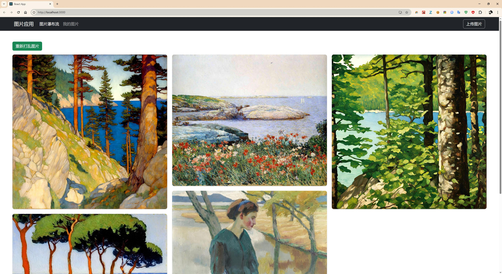
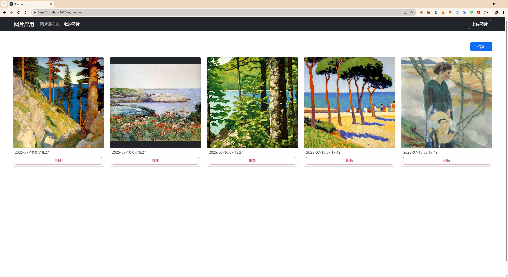

### 目标

1. 查看图片，瀑布流。
2. 删除图片，比如从100个图片里面删除 10个。
3. 你以为很难的地方，其实不难(比如，算法)； 
4. 你以为不重要的地方，其实很重要(比如，前端 app, 展示效果)。

### 重要说明

1. 请把自己的图片放在
    > python_api/nice_imgs  
    > 或是自定义文件夹。找到 main.py, 修改 img_root_dir = "./nice_imgs"

2. windows 系统, 请直接运行
    > just_run.bat

## 分步骤运行

### 1. 启动 server
- api:   uvicorn main:app --reload
- 或者:   
- uvicorn main:app  --reload --host 0.0.0.0 --port 8000

转到:   http://127.0.0.1:8000/docs
转到:   http://127.0.0.1:8000/images

### 2. 启动前端 react client
- npm start 
